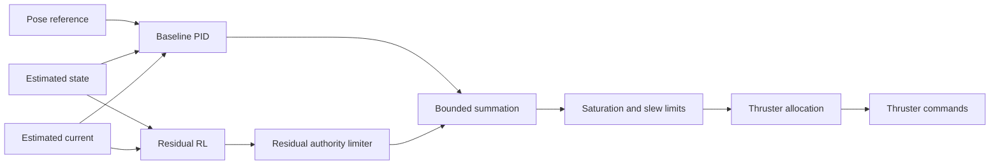

# Control Architecture

## Controller hierarchy



## Baseline controller

The baseline produces generalized force and moment:

```text
tau_pid = Kp * error + Ki * integral(error) + Kd * error_rate + disturbance_feedforward
```

Required protections:

- Integrator clamping or back-calculation anti-windup
- Derivative filtering
- Per-axis output limits
- Total force and moment limits
- Command slew-rate limiting
- Explicit reset and bumpless mode transfer

## Residual RL controller

```text
tau_command = tau_pid + alpha * delta_tau_rl
```

Where:

- `delta_tau_rl` is normalized and bounded.
- `alpha` is the permitted RL authority.
- Initial authority should be conservative.
- Invalid, stale, or non-finite RL output is replaced by zero.

## Fallback behavior

1. Healthy PID and healthy RL: use PID plus bounded residual.
2. Healthy PID and stale RL: use PID only.
3. Stale target but valid state: enter safe hold or retain the last validated reference according to configuration.
4. Stale state: disarm simulated actuation.
5. Critical fault or emergency stop: enter latched safe state.

## Required controller comparison

- PID
- PID with disturbance compensation
- Residual RL over the same PID
- Optional MPC benchmark only if schedule permits

All controllers must use identical plant seeds, scenario seeds, limits, and evaluation windows.
