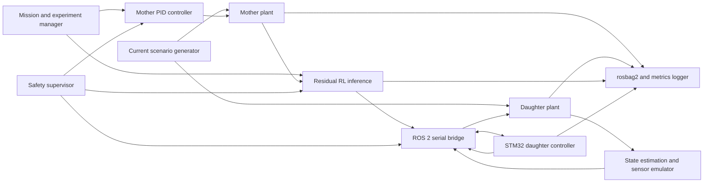
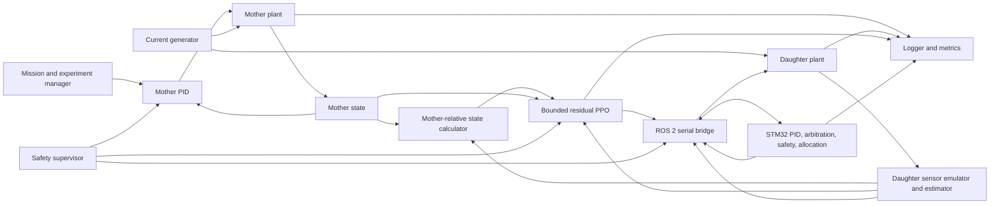

# System Architecture

## Deployment view

## Host responsibilities

- Mother and daughter plant integration
- Ocean-current generation
- Sensor emulation and state estimation
- Mother PID
- RL training and inference
- Mission and experiment management
- ROS 2 bridge, logging, visualization, and metrics
- Fault injection

## STM32 responsibilities

- Fixed-rate control scheduler
- Daughter PID
- Generalized-force command arbitration
- Thruster allocation
- Saturation and slew limits
- Packet validation
- Sequence and stale-command checks
- Watchdog and safe-state transitions
- Telemetry and timing measurements

## Timing budget

| Function | Initial rate |
|---|---:|
| Plant integration | 500 to 1000 Hz |
| STM32 control loop | 200 Hz |
| Host-to-STM32 state | 100 Hz |
| STM32 telemetry | 50 to 100 Hz |
| State estimator | 100 Hz |
| RL inference | 20 to 50 Hz |
| Mission manager | 10 Hz |
| Diagnostics | 1 to 10 Hz |

## Architectural principles

1. ROS 2 is not part of the hard real-time MCU feedback loop.
2. The STM32 must remain safe if host communication stops.
3. RL outputs generalized residual force and moment, not raw PWM.
4. Every message includes units, frame, timestamp, and validity.
5. Experiments are configuration-driven and replayable.
6. Safety limits are enforced after RL and before actuation.

<!-- AUDIT-FIX: -->
## Canonical corrected feedback architecture

The following diagram supersedes any earlier diagram only where the edges conflict. Existing explanatory content remains valid unless explicitly contradicted below.

The mother may use exact simulated state in Version 1; the daughter uses sensor-emulated or estimated state. This asymmetry is a documented limitation.

Initial rates are loaded from `config/system_limits.yaml`. Daughter PID and state transport both begin at 100 Hz to avoid multirate derivative chatter. Plant integration runs faster and RL inference runs slower with zero-order hold.
<!-- AUDIT-FIX: -->
