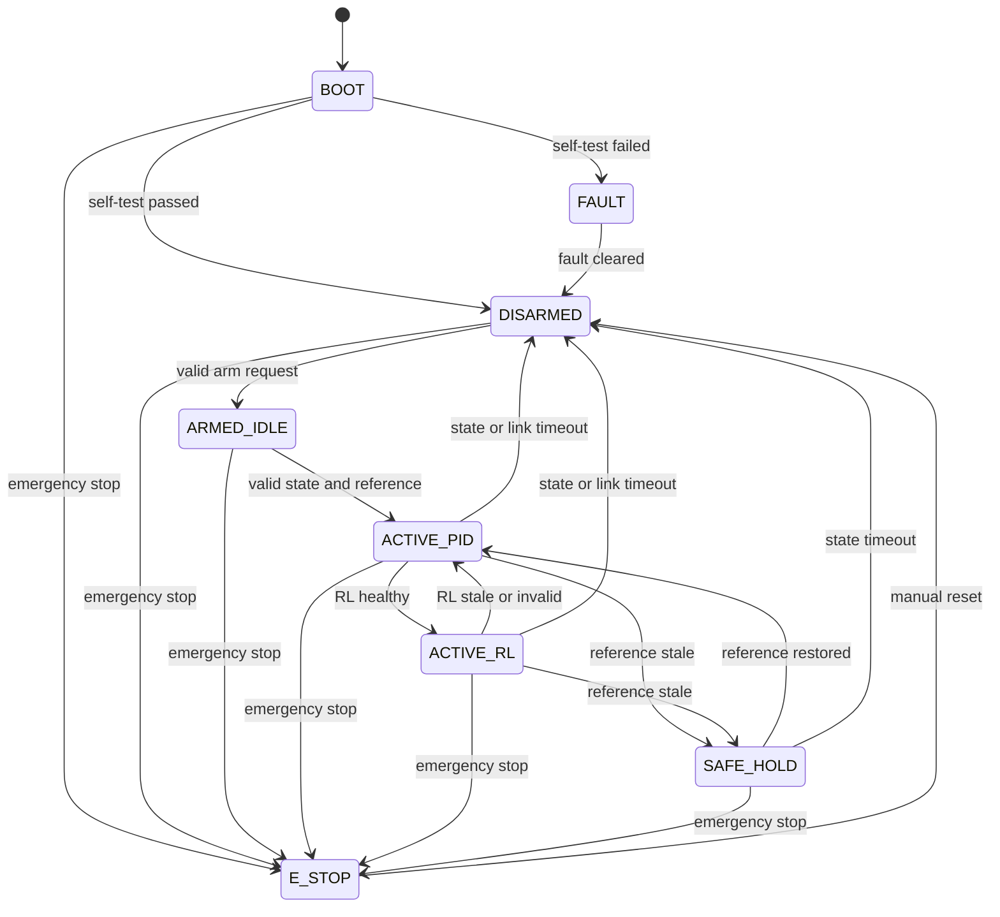
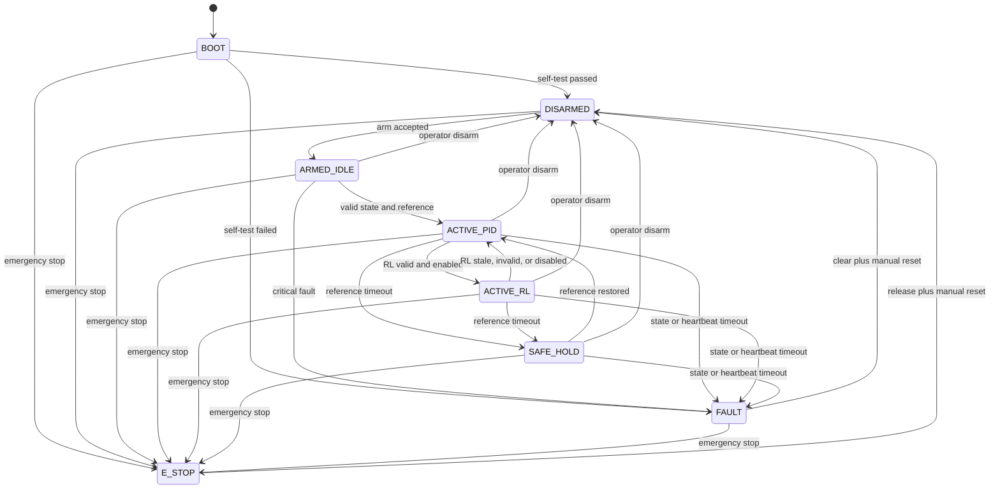

# Safety and Fault-Management Plan

## Safety objective

No software component, learning policy, malformed message, stale host command, or single recoverable communication fault may produce unbounded actuator commands.

## State machine

## Mandatory protections

- Watchdog
- Brownout handling
- Neutral startup
- Explicit arm/disarm
- Emergency stop
- State, reference, heartbeat, and RL timeouts
- CRC and sequence checks
- Saturation and slew limits
- NaN and infinity rejection
- Persistent fault counters
- Latched critical faults
- Controlled fault reset

## Bench safety

- Do not test exposed propellers under power.
- Use simulated loads or disconnected motors for initial HIL.
- Use current-limited supplies when hardware is introduced.
- Isolate RS-485 where ground differences may exist.
- Record every safety bypass and remove it before final evaluation.

## Safety evidence

Each safety requirement must map to:

- implementation issue;
- unit or integration test;
- test evidence;
- final verification status.

<!-- AUDIT-FIX: -->
## Canonical corrected safety state machine

`SAFE_HOLD` retains the last validated reference while state remains valid. `FAULT` and `E_STOP` are latched. Numeric timeout values come from `config/system_limits.yaml`. Every transition requires a positive test, rejection test, and logged transition reason.
<!-- AUDIT-FIX: -->
